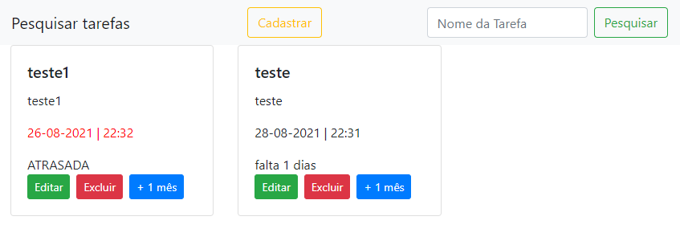

#  📅  Cadastro de tarefas (agenda)
## Apresentação

Sistema para cadastro e controle de tarefas (agenda), onde pode ser editada, cadastrada, excluida e renovada. Além de outras funções de cálculos referente a prazos.  
- Projeto baseado no repositório [ToDoList](https://github.com/ZxPedro/ToDoList).




## Instalação
### Requisitos:

``` 
- Servidor WEB VPS linux. É necessário que o apache, php e mysql estejam instalados e configurados corretamente. 
 ```
 
 ### Banco de dados:

 ``` 
 - Criação do banco de dados chamado "todolist";
 - Importação do arquivo "tarefas.sql" dentro do banco de dados;
 ```


